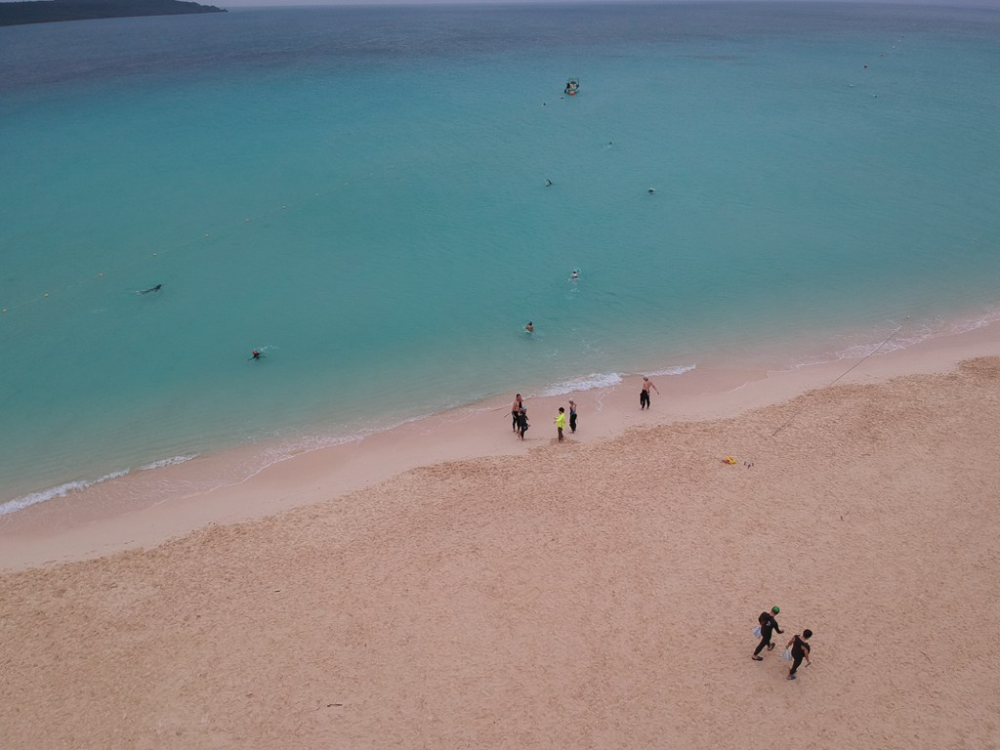

## 长距离铁三比赛经历分享

- 娄明明
- 2018-11-03

## 自我介绍
- 姓名：娄明明
- 职业：程序员
- 生日：1989年
- 2015年开始打铁
- 2018年起定居杭州
- 全马PB 4h23m
- 标铁PB 2h56m
- 大铁PB 13h58m

## 长距离比赛经历
- 2016-09-11 威海 铁三世界系列赛 长距离(103km)
- 2016-10-16 合肥 Ironman70.3 (113km)
- 2017-04-29 台东 Challenge Taiwan(226km)<!-- .element style="color:red" -->
- 2017-05-21 黄山 黄山极限铁三(113km)
- 2018-04-22 宫古岛 Strongman (202km)<!-- .element style="color:red" -->

## 威海长距离
- 第一次双倍距离
- 骑车难度全国第一
-  <!-- .element height="50%" width="50%" -->

- 游泳，全场倒数第一(比70+岁的爷爷还慢)
-  <!-- .element height="90%" width="90%" -->

- 骑车，换项区只剩一辆车，刚上路就被队友套圈(20km)
-  <!-- .element height="50%" width="50%" -->

- 跑步，跑跑走走
-  <!-- .element height="50%" width="50%" -->

- 完赛
-  <!-- .element height="90%" width="90%" -->

## 合肥70.3
- IRONMAN重回中国第一站
- 比较简单的赛道

- 游泳
-  <!-- .element height="50%" width="50%" -->

- 骑车
-  <!-- .element height="90%" width="90%" -->

- 跑步
-  <!-- .element height="50%" width="50%" -->

## Challenge Taiwan 226
- 简单的226
    - 大型游泳池
    - 骑车比较平，两折返
    - 跑步补给好
    - 关门不紧张(17h)
- 苦练数月，一切顺利

- 游泳
-  <!-- .element height="90%" width="90%" -->

- 骑车
-  <!-- .element height="50%" width="50%" -->

- 骑车
-  <!-- .element height="90%" width="90%" -->

- 跑步
-  <!-- .element height="50%" width="50%" -->

- 冲线
-  <!-- .element height="90%" width="90%" -->

- 成绩
-  <!-- .element height="50%" width="50%" -->

## 黄山极限铁三(113km)
- 极限铁三
    - 游泳1.9km
    - 骑车90km(实际82km 爬升858m)
    - 跑步21km(实际20km 爬升1869m 600层楼)
- 背靠背，最后跑步崩了

- 路线图
-  <!-- .element height="50%" width="50%" -->

- 定妆照（铁三+越野）
-  <!-- .element height="60%" width="60%" -->

- 游泳
-  <!-- .element height="90%" width="90%" -->

- 骑车
-  <!-- .element height="90%" width="90%" -->

- 跑步
-  <!-- .element height="90%" width="90%" -->

- 和父母一起冲线
-  <!-- .element height="50%" width="50%" -->

## 宫古岛 Strongman (202km)
- 进阶铁三
    - 🏊游泳3km
    - 🚴骑车157km(爬升1187m)
    - 🏃跑步42.195km(爬升284m)
    - 🚪关门13.5h
- 关门紧，适合大铁14h以内的选手
- 教练辅导，降低疲劳

- 路线图
-  <!-- .element height="90%" width="90%" -->

- 游泳
-  <!-- .element height="90%" width="90%" -->

- 骑车
-  <!-- .element height="90%" width="90%" -->

- 跑步
-  <!-- .element height="90%" width="90%" -->

- 欢乐铁三集体合影
-  <!-- .element height="90%" width="90%" -->

## 我的比赛态度与心得
- 保证不受伤，尽可能完赛
    - 基础比较差
        - 从小没天赋
        - 乳酸阈值
        - VO2MAX
    - 反正拿不到名字和奖金
    - 留得青山在
- 敢报，不怕完不成
- 找个教练，省力一半，成功加倍